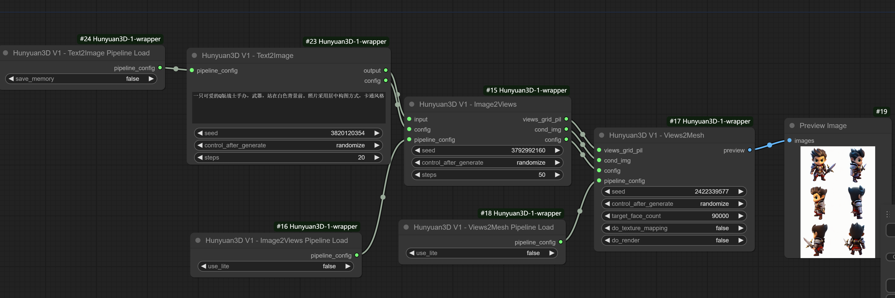

[English](README.md) | [简体中文](README_zh_CN.md)
# ComfyUI Hunyuan3D-1-wrapper

**ComfyUI Hunyuan3D-1-wrapper** is a custom node that allows you to run [Tencent/Hunyuan3D-1](https://github.com/Tencent/Hunyuan3D-1) in ComfyUI as a wrapper.

**!!To avoid breaking your existing environment, it is strongly recommended to use a fresh ComfyUI installation for this node**

# Setup
Please note that this plugin currently doesn't have an easy way to install in ComfyUI. I'll provide several scenarios for reference.

Additionally, the following environments are all based on Windows 10 + CUDA 12.4 + Python 3.12.

## Scenario 1: ComfyUI Bundle(Python 3.12) + 3D Pack
If you downloaded ComfyUI from the ComfyUI Release page (current latest version 0.2.7, bundled with Python 3.12) and have successfully installed 3D Pack, congratulations, you only need a few steps:
1. git clone this repository
2. pip install -r requirements.txt

Theoretically, if you have successfully installed 3D Pack, this means your Python environment already has special dependency packages like Pytorch3D. For more information, please refer to the 3D Pack page.

## Scenario 2: ComfyUI Bundle(Python 3.12)
If you downloaded ComfyUI from the ComfyUI Release page (current latest version 0.2.7, bundled with Python 3.12) but haven't installed 3D Pack, you'll need some additional steps to package related dependencies.

It should be noted that if you plan to use ComfyUI's built-in Python, **texture mapping** and **gif output** will not be available in this node.

### Package and Install Pytorch3D
Pytorch3D is a major challenge during installation, whether for 3D Pack or this node. Reference steps:
1. Install C++ build tools locally, and check the following during installation: 
2. Create a Python 3.12 environment using conda:  
`conda create -n comfy-hunyuan3d-py312-build python=3.12`
3. Activate conda environment:  
`conda activate comfy-hunyuan3d-py312-build`
4. Install torch:  
`pip install torch==2.5.1 --index-url https://download.pytorch.org/whl/cu124`
5. Package pytorch3d wheel:  
`pip wheel git+https://github.com/facebookresearch/pytorch3d`
If everything goes smoothly, you'll see the pytorch3d wheel file in your current directory
6. Install pytorch3d wheel using comfyui's bundled python:  
`{comfyUI_python_embeded}\python -m pip install pytorch3d-0.7.8-cp312-cp312-win_amd64.whl`

### Install Open3D
Currently, Open3D hasn't released packages for Python 3.12, but you can download the Python 3.12 dev version from their github:
1. Download the wheel for py3.12+win:  
`https://github.com/isl-org/Open3D/releases/tag/main-devel`
2. Install local Open3D wheel using comfyui's bundled python:  
`{comfyUI_python_embeded}\python -m pip install open3d-0.18.0+fcc396e-cp312-cp312-win_amd64.whl`

### Install Hunyuan3D-1 Node Dependencies
1. `git clone` this repository in ComfyUI's custom nodes folder
2. `{comfyUI_python_embeded}\python -m pip install -r requirements.txt`
3. `{comfyUI_python_embeded}\python -m pip install git+https://github.com/NVlabs/nvdiffrast`
4. `{comfyUI_python_embeded}\python -m pip install Ninja`

Again, reminder that in this scenario, **texture mapping** and **gif output** are not available.

## Scenario 3: Using ComfyUI in Conda Environment (Recommended)
From my personal perspective, this is my most recommended approach, as texture mapping and gif output can be used in this environment. Specific steps:
1. Install C++ build tools locally, and check the following during installation: 
2. Create a Python 3.12 environment for ComfyUI using Conda:  
`conda create -n hunyuan3d-comfyui-py312 python=3.12`
3. Activate the environment:  
`conda activate hunyuan3d-comfyui-py312`
4. Install torch and torchvision:  
`pip install torch torchvision --index-url https://download.pytorch.org/whl/cu124`
5. Go to ComfyUI's own directory (containing requirements.txt), install ComfyUI's dependencies:  
`pip install -r .\requirements.txt`
6. `pip install git+https://github.com/facebookresearch/pytorch3d`
7. `pip install git+https://github.com/NVlabs/nvdiffrast`
8. Download Open3D wheel for py3.12+win:  
**https://github.com/isl-org/Open3D/releases/tag/main-devel**
9. `pip install open3d-0.18.0+fcc396e-cp312-cp312-win_amd64.whl`
10. `git clone` this repository in ComfyUI's custom nodes folder
11. Install this repository's dependencies:  
`pip install -r requirements.txt`
12. `pip install Ninja`

Run the following command in ComfyUI's root directory to start:
`python -s main.py --windows-standalone-build`

## Other Launcher Scenarios (aki, StabilityMatrix, etc.)
I apologize, but I personally don't have the habit of using these launchers. Since different launchers bind to different environments, due to time constraints, I haven't done any testing on them. However, theoretically, they should all work - please research on your own.

# Download Checkpoints
Regardless of which scenario you use, after installing the above dependencies, we still need to manually download related checkpoints. Specific steps:
1. Install **huggingface-cli** using system environment or Conda python:  
`pip install "huggingface_hub[cli]"`  
Ensure the command **huggingface-cli** is available.
2. Go to this node's folder in ComfyUI, create **weight** folder, and create **hunyuanDiT** folder in the weights folder
3. Run in this node's directory:  
`huggingface-cli download tencent/Hunyuan3D-1 --local-dir ./weights`  
and  
`huggingface-cli download Tencent-Hunyuan/HunyuanDiT-v1.1-Diffusers-Distilled --local-dir ./weights/hunyuanDiT`

# Runtime
1. Output path is at **ComfyUI/output/Unique3D/Hunyuan3D-1/**

# Workflow
Here I provide two workflows:
- Text to 3D [example-text2mesh](workflow/example-text2mesh.json)
- Image to 3D [example-text2mesh](workflow/example-image2mesh.json)

Please understand the node usage in conjunction with the workflows.

## Credit
[Credit section remains unchanged as it was already in English]

## My extensions for ComfyUI
[Extensions section remains unchanged as it was already in English]

## My extensions for stable diffusion webui
[Extensions section remains unchanged as it was already in English]
