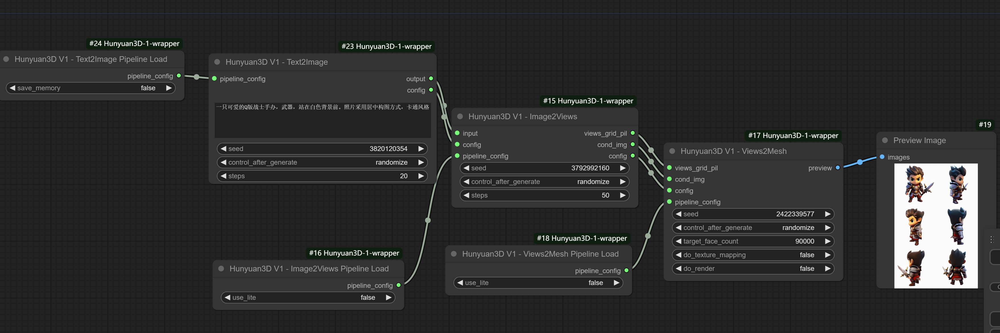
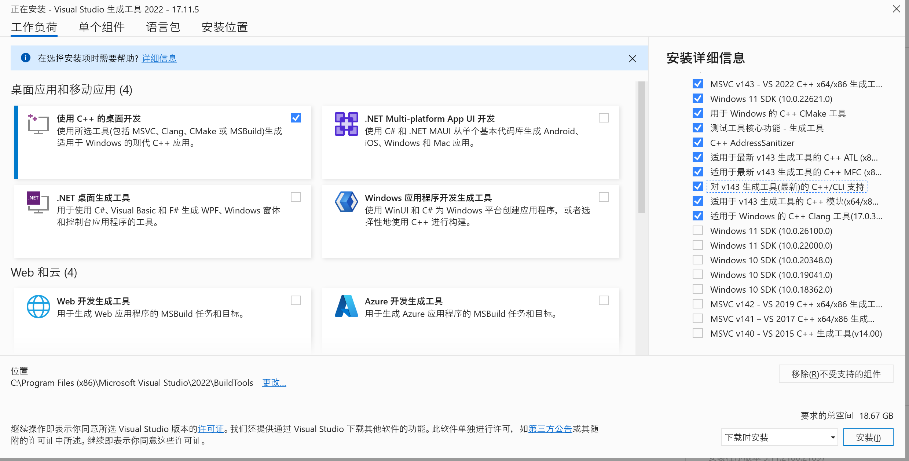
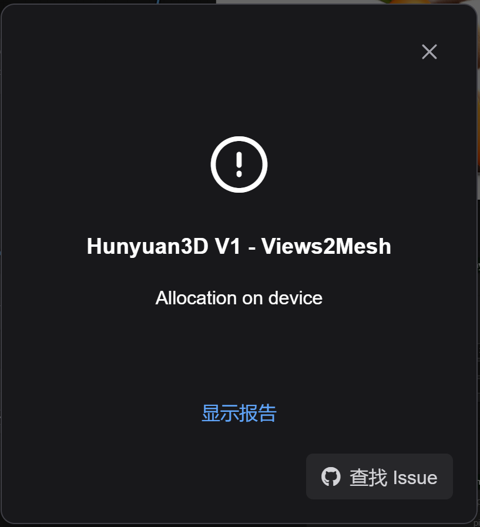

[English](README.md) | [简体中文](README_zh_CN.md)
# ComfyUI Hunyuan3D-1-wrapper

**ComfyUI Hunyuan3D-1-wrapper** 是一个自定义的节点，以Wrapper的方式允许你在ComfyUI中运行 [Tencent/Hunyuan3D-1](https://github.com/Tencent/Hunyuan3D-1)

**!!为了避免破坏你已有的环境，强烈推荐使用一个全新的ComfyUI安装此节点**

# Setup
请注意，这个插件目前没有简单办法地安装在ComfyUI中，我会提供几种情况以供参考。

另外，下述环境均是Windows 10 + CUDA 12.4 + Python 3.12。

## 情况1，ComfyUI Bundle(Python 3.12) + 3D Pack
如果你是从ComfyUI的中下载的ComfyUI（当前最新版本0.2.7，绑定的是Python 3.12）的同时也已经成功安装了，那个恭喜你，你不需要安装这个库了，3D pack已经在它里面实现了混元3D。

## 情况2，ComfyUI Bundle(Python 3.12) 
如果你是从ComfyUI的Release page中下载的ComfyUI（当前最新版本0.2.7，绑定的是Python 3.12），但是没有安装3D Pack，你需要一些额外的步骤进行相关依赖的打包。

需要提前说明的是，如果准备使用ComfyUI自带的python，那么这个节点中的**texture mapping**和**gif输出**是不可用的。

### Pytorch3D打包并安装
Pytorch3D是安装过程中的一大困难，无论是3D Pack还是本节点，参考步骤：
1. 本地安装了C++ build tools，同时安装的时候勾选上：
2. 使用conda创建一个python 3.12环境：  
`conda create -n comfy-hunyuan3d-py312-build python=3.12`
3. 启动conda环境：  
`conda activate comfy-hunyuan3d-py312-build`
4. 安装torch：  
`pip install torch==2.5.1 --index-url https://download.pytorch.org/whl/cu124`
5. 打包pytorch3d的wheel：  
`pip wheel git+https://github.com/facebookresearch/pytorch3d`
如果一切顺利，会在你当前运行的目录中出现pytorch3d的wheel文件
6. 使用comfyui绑定的python安装pytorch3d的wheel：  
`{comfyUI_python_embeded}\python -m pip install pytorch3d-0.7.8-cp312-cp312-win_amd64.whl`

### Open3D的安装
目前Open3D没有发布针对Python3.12的打包，但是可以从它的github里下载到给Python 3.12 dev版：
1. 下载针对py3.12+win的wheel：  
`https://github.com/isl-org/Open3D/releases/tag/main-devel`
2. 使用comfyui绑定的python安装本地的Open3D的wheel：  
`{comfyUI_python_embeded}\python -m pip install open3d-0.18.0+fcc396e-cp312-cp312-win_amd64.whl`

### Hunyuan3D-1节点的依赖安装
1. 在ComfyUI的custom nodes文件夹中`git clone` 这个库
2. `{comfyUI_python_embeded}\python -m pip install -r requirements.txt`
3. `{comfyUI_python_embeded}\python -m pip install git+https://github.com/NVlabs/nvdiffrast`
4. `{comfyUI_python_embeded}\python -m pip install Ninja`

再次提醒，在这种情况下**texture mapping**和**gif输出**是不可用的。

## 情况3，在Conda环境使用ComfyUI（推荐）
从我个人的角度，这是我最推荐的方式，在这种环境下可以使用texture mapping和gif输出。具体步骤：
1. 本地安装了C++ build tools，同时安装的时候勾选上：
2. 创建一个供ComfyUI使用的Conda的Python 3.12环境:  
`conda create -n hunyuan3d-comfyui-py312 python=3.12`
3. 激活该环境：  
`conda activate hunyuan3d-comfyui-py312`
4. 安装torch和torchvision：  
`pip install torch torchvision --index-url https://download.pytorch.org/whl/cu124`
5. 进到ComfyUI自身的目录中（包含requirements.txt的那个），安装ComfyUI自己的依赖：  
`pip install -r .\requirements.txt`
6. `pip install git+https://github.com/facebookresearch/pytorch3d`
7. `pip install git+https://github.com/NVlabs/nvdiffrast`
8. 下载Open3D针对py3.12+win的wheel：  
**https://github.com/isl-org/Open3D/releases/tag/main-devel**
9. `pip install open3d-0.18.0+fcc396e-cp312-cp312-win_amd64.whl `
10. 在ComfyUI的custom nodes文件夹中`git clone` 这个库 
11. 安装这个库的依赖：  
`pip install -r requirements.txt`
12. `pip install Ninja`

在ComfyUI的根目录下运行以下命令启动：
`python -s main.py --windows-standalone-build`

## 其他启动器的情况（秋叶，StabilityMatrix等）
很抱歉的是，我个人没有使用这些启动器的习惯，因为不同启动器绑定的环境均不相同，时间关系没有对它们进行任何测试，不过理论上都可以运行，请自行研究。

# Checkpoints下载
无论使用哪种情况，我们在安装好了之后上述依赖后，还需要手动下载相关的checkpoints，具体步骤如下：
1. 使用系统环境或是Conda中的python安装**huggingface-cli**：  
`pip install "huggingface_hub[cli]"`  
保证命令**huggingface-cli**是可用的。
2. 在此节点的目录中运行：  
`huggingface-cli download tencent/Hunyuan3D-1 --local-dir ./weights`  
和  
`huggingface-cli download Tencent-Hunyuan/HunyuanDiT-v1.1-Diffusers-Distilled --local-dir ./weights/hunyuanDiT`  
4. 或者，因为ComfyUI原生支持HunyuanDit，你可以从[这个](https://huggingface.co/comfyanonymous/hunyuan_dit_comfyui/blob/main/hunyuan_dit_1.2.safetensors)下载它的checkpoint，并把它放在**ComfyUI/models/checkpoints**文件夹中

# Runtime
1. 输出路径在 **ComfyUI/output/Unique3D/Hunyuan3D-1/**

# Workflow
这里我提供三个工作流：
- 文生3D - native [example-text2mesh-native](workflow/example-text2mesh-native.json)
对于这个工作流:
1. 确保下载了HunyuanDit的checkpoint并放在checkpoints文件夹中
2. 保留负提示词
3. 保留最后三个正提示词 (**,白色背景,3D风格,最佳质量**) 然后把你自己的提示词加到它们前面, 例如： **a lovely rabbit eating carrots, 白色背景,3D风格,最佳质量**
- 文生3D [example-text2mesh](workflow/example-text2mesh.json)
- 图生3D [example-image2mesh](workflow/example-image2mesh.json)

具体节点的使用请配合工作流理解。

# 已知问题
有时在生成Mesh的阶段可能会报错**torch.OutOfMemoryError: Allocation on device** 
但是如果重新运行几次的话，就有可能生成成功。如果遇到这种情况，可以使用固定的seed节省时间。

## Credit
- [Tencent/Hunyuan3D-1](https://github.com/Tencent/Hunyuan3D-1) - A Unified Framework for Text-to-3D and Image-to-3D Generation
- [ComfyUI](https://github.com/comfyanonymous/ComfyUI) - A powerful and modular stable diffusion GUI.
- [ComfyUI-3D-Pack](https://github.com/MrForExample/ComfyUI-3D-Pack) - An extensive node suite that enables ComfyUI to process 3D inputs (Mesh & UV Texture, etc) using cutting edge algorithms (3DGS, NeRF, etc.)

## My extensions for ComfyUI
- [ComfyUI-Unique3D](https://github.com/jtydhr88/ComfyUI-Unique3D) - ComfyUI Unique3D is custom nodes that running Unique3D into ComfyUI
- [ComfyUI-LayerDivider](https://github.com/jtydhr88/ComfyUI-LayerDivider) - ComfyUI LayerDivider is custom nodes that generating layered psd files inside ComfyUI
- [ComfyUI-InstantMesh](https://github.com/jtydhr88/ComfyUI-InstantMesh) - ComfyUI InstantMesh is custom nodes that running InstantMesh into ComfyUI
- [ComfyUI-ImageMagick](https://github.com/jtydhr88/ComfyUI-ImageMagick) - This extension implements custom nodes that integreated ImageMagick into ComfyUI
- [ComfyUI-Workflow-Encrypt](https://github.com/jtydhr88/ComfyUI-Workflow-Encrypt) - Encrypt your comfyui workflow with key

## My extensions for stable diffusion webui
- [3D Model/pose loader](https://github.com/jtydhr88/sd-3dmodel-loader) A custom extension for AUTOMATIC1111/stable-diffusion-webui that allows you to load your local 3D model/animation inside webui, or edit pose as well, then send screenshot to txt2img or img2img as your ControlNet's reference image.
- [Canvas Editor](https://github.com/jtydhr88/sd-canvas-editor) A custom extension for AUTOMATIC1111/stable-diffusion-webui that integrated a full capability canvas editor which you can use layer, text, image, elements and so on, then send to ControlNet, basing on Polotno.
- [StableStudio Adapter](https://github.com/jtydhr88/sd-webui-StableStudio) A custom extension for AUTOMATIC1111/stable-diffusion-webui to extend rest APIs to do some local operations, using in StableStudio.
- [Txt/Img to 3D Model](https://github.com/jtydhr88/sd-webui-txt-img-to-3d-model) A custom extension for sd-webui that allow you to generate 3D model from txt or image, basing on OpenAI Shap-E.
- [3D Editor](https://github.com/jtydhr88/sd-webui-3d-editor) A custom extension for sd-webui that with 3D modeling features (add/edit basic elements, load your custom model, modify scene and so on), then send screenshot to txt2img or img2img as your ControlNet's reference image, basing on ThreeJS editor.
